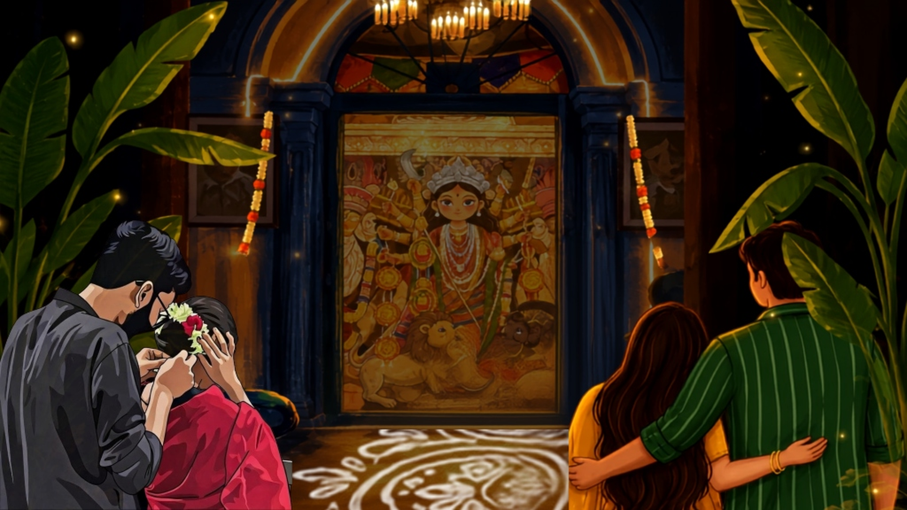

# 🪔 Agomoni Vibes — Deluxe Saloon Music Player

An interactive, high-aesthetic web application and audio player interface built for the festive Durga Puja Agomoni celebration. Designed with modern glassmorphism UI, floating audio widgets, live interactive elements, and YouTube audio streaming.



## ✨ Features

- **Deluxe Saloon Floating Player**: Dark acrylic glassmorphic UI (`backdrop-filter: blur(20px)`), spinning vinyl album art, seek slider, volume controls, and timeline progress tracking.
- **YouTube Audio Integration**: Streams music directly from YouTube playlist tracks with dynamic YouTube thumbnail art for each song.
- **Live Header Widgets**: Live local clock (`12:34 AM`) and fluctuating online listener counter (`🟢 850+ online`).
- **Interactive Parallax & Particles**: Dynamic mouse-driven background parallax physics and golden firefly canvas particles.
- **Header Navigation**: Single-line pill links for Spotify, YouTube Music, Playlists, Songs, and Install.
- **Bengali Festive Typography**: Bold Google Noto Serif Bengali typography centered cleanly over custom Durga Puja artwork.

## 🚀 Built With

- **HTML5 & Vanilla CSS3**: Custom glassmorphism, keyframe animations, and hardware acceleration optimizations.
- **Vanilla JavaScript (ES6+)**: Custom canvas particle system, mouse movement parallax, and YouTube IFrame Player API integration.

## 🛠️ Getting Started

Simply open `index.html` in any web browser or serve it locally:

```bash
# Clone the repository
git clone https://github.com/SHREEJIT-MAIN/MUSIC-PLAYER.git

# Navigate into project directory
cd MUSIC-PLAYER

# Run local web server (optional)
python -m http.server 8080
```

---

*Build with ❤️ by Shreejit*
